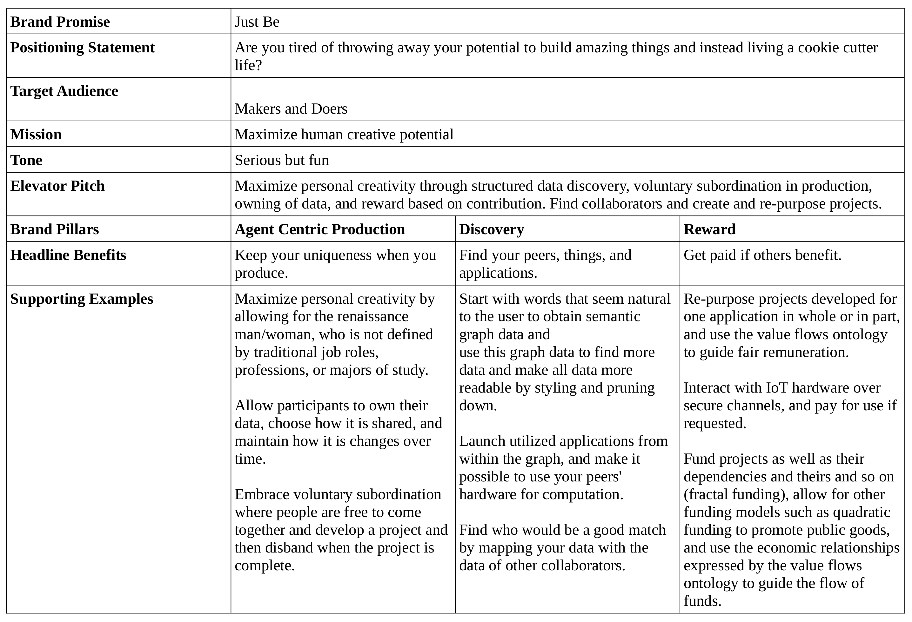

Key Architectural Points:

Data wanted by agents or likely wanted by agents should be stored locally

Occassionally queries of data will require accessing data not stored locally. Semantics will be used for query routing.

Data should be secure at rest and verifiable to participating agents

Data when transferred from one agent to another should flow over cryptographically secure channels

Humans adding graph data to the system should be assisted by computer alogrithms when possible

Data will be structured by ontologies and will be provably mapped to data structured by other ontologies

Some graph data will link to data produced by applications

Appplications will have access to a distributed and decentralized compute structure “P2P Arch”

Graph data will describe agents, their actions, and projects agents work on
Some graph data will link to descriptions of producers or potential producers for a competitive distributed manufacturing scheme

Some edge devices that are activated by interaction will only be activated if a verifiable presentation consisting of verifiable credential(s)
contains attestations allowing them to do so.

Some graph data will initiate actions by software agents or physical machines treated as edge devices producing production

Graph data will be preferentially stored in a content addressable rather than location addressable way

Graph data distributed amongst agents will follow linked data principles and build a giant global graph

NRP Logging and the Open Value Network Ontology will be used to record economic activity for later reward.

EISPP – Enterprise Information System for Peer Production – by Brent Shambaugh – Updated: February 1st 2024 – Page 3

Start with an evisioned project and find similar or component projects by using a “Natural Language Query”

Refine query results with the following tools: “Ontology Browser”, “Linked Data Browser”, “SPARQL endpoint”, or “Faceted Browsing”.

Also include the skipping of the the “Natural Language Query” to begin with these tools.

Add additional graph data with “How to Add a 2nd File”, edit triples with algorithmic suggestion with “NLP Edit”, and edit triples without
algorithmic suggestion with “Edit Triples”

Stylize data to make it easier to digest with Graph Stylesheets (“GSS URI SPARQL” and “FRESNEL GSS”), “Preferences”, and “OPM”
Change graph layout algorithm with “Preferences” to make the data easier to digest

“VRM” or Vendor Relationship Management, a term borrowed from ProjectVRM, is one of the most advanced parts of EISPP’s user
interface. It functions as a place to collect data from queries and save it locally, a portal to access and see an overview of local data, merge
data graphs with different algorithms if desired, load badges describing skills and accomplishments which could be verfiable credentials if
extended with crypotography or possibly a ledger, load profiles about agents and data about products produced by groups, modify access
control options for data, transact by sending funds to agents and projects described in the graph with a wallet (include “Ripple Transaction”
and “CryptoCoin”), and add provenance describing data like issuance time, certificates describing quality, and which parties supported
production

Designs for produced components of projects are described by metadata linked to the graph and referenced within applications

Applications refereneced in the wireframes include Code Aster which is a finite element solver for structural and thermal analysis [1],
wxMaxima which is a front end for the computer algebra system Maxima[2], OpenFoam which is a computational fluid dynamics solver,
etherpad which is a collaborative document editor [3], OpenModelica which is an open source Modelica language based modeling and
simulation environment for complex and dyanmic systems that can be mechanical, electrical, hydraulic, thermal, process oriented, or a
combination thereof [4]

View, Applications, HP Computing, Value Network/*, Edit Triples, Provenance, Production, IoT, and the top bar are extensible categories
“Aggregation of Data” will be performed by clustering and reasoning by Swarm Intelligence

[1]https://www.simscale.com/forum/t/more-on-code-aster/32239 ,[2] https://etherpad.org/ [3] https://wxmaxima-developers.github.io/wxmaxima/download.html, [4] https://en.wikipedia.org/wiki/OpenModelica
reference for “”: wireframes described in http://bshambaugh.org/eispp/
